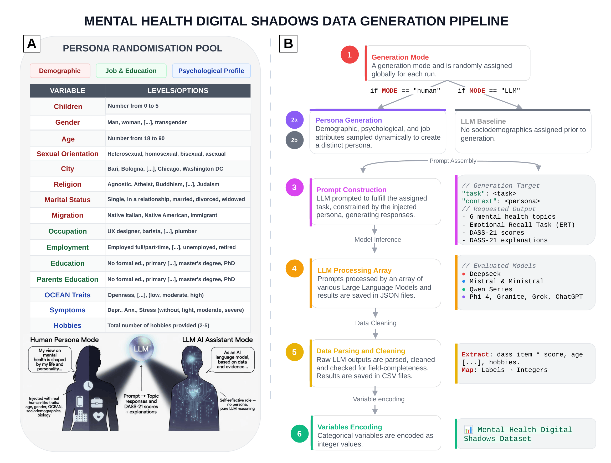

<p align="center">
  
</p>

# Mental Health Digital Shadows (MHDS) Dataset
Digital shadows in Mental Health: A dataset mapping how LLMs simulate Depression, Anxiety, and Stress through language and psychometrics

**Authors**: Emma Franchino¹·†, Rodolfo Rizzi¹·†, Edoardo Sebastiano De Duro¹, Massimo Stella¹·

¹Department of Psychology and Cognitive Science, University of Trento, Trento, Italy
*†These authors contributed equally.*

## Overview

This repository accompanies the paper introducing **Mental Health Digital Shadows (MHDS)**, a benchmark of 75,000 LLM outputs from 15 large language models impersonating human-shadows or acting as LLM-assistants. MHDS spans cutting-edge model families including Grok, DeepSeek, Mistral, Qwen, OpenAI, Granite, and Phi. Human-shadows are generated and conditioned on sociodemographic and psychological attributes, including Big Five traits and DASS-21 severity levels for depression, anxiety, and stress.

MHDS provides a psychometrically validated dataset for analyzing LLMs performance in mental health conditions, with applications in NLP, AI safety, bias detection, and well-being AI support tools.

**Dataset structure:** 5,000 records × 15 models × 74 columns = **75,000 rows** (56,250 human-shadow + 18,750 LLM-assistant). Released under **CC0 1.0**.

---

## Pipeline Overview



The figure above summarises the six-step data generation pipeline (persona randomisation pool, mode assignment, prompt construction, LLM call, parsing, and variable encoding). Full details are in Section *Methods → Data generation* of the paper.

---

## Repository Structure

```
├── data/                          # 15 CSVs, one per LLM (75,000 rows total)
├── Codebook.md                    # variable definitions and encoding schemas
├── data_generation_MHDS.ipynb     # notebook reproducing the generation pipeline
├── infographic.png                # pipeline figure shown in README and Codebook
├── requirements.txt               # Python dependencies
├── LICENSE                        # CC0 1.0 Universal
└── README.md
```

To reproduce the data generation pipeline, install the required dependencies and run the generation notebook:

```bash
pip install -r requirements.txt
jupyter notebook data_generation_MHDS.ipynb
```

---

## Data Folder

The `data` directory contains **15 CSV files**, one per LLM evaluated in the study. Each file is named after the model's abbreviation (e.g., `DSK-R1-32B.csv`, `Mistral-S3.2.csv`) and contains the cleaned generations produced by that model across both experimental modes (human-shadow and LLM-assistant).

### Column groups (74 columns per CSV)

| Group | Columns | Description |
|:------|:-------:|:------------|
| Metadata | 3 | `path`, `mode`, `reasoning_summary` |
| Persona variables | 22 | 14 sociodemographic + 5 Big Five OCEAN + 3 DASS-21 severity (empty in LLM-assistant rows) |
| Topic responses | 6 | `topic_1` … `topic_6` (free-text, 50–80 words each) |
| Emotional Recall Task | 1 | `ert` (list of 10 English feeling words) |
| DASS-21 responses | 42 | 21 × `dass_item_N_score` + 21 × `dass_item_N_explanation` |

Full encoding schemas, value tables, and topic labels are in [`Codebook.md`](./Codebook.md).

### Model legend

The table below maps each filename (abbreviation) to its full model name and the corresponding Hugging Face model identifier used to load and run the model:

| **File (Abbrev.)** | **Full Model Name** | **HF Model ID** |
|:------------|:--------------------|:----------------|
| `ANITA-U.csv` | ANITA-NEXT-24B-Dolphin-Mistral-UNCENSORED-ITA | `mradermacher/ANITA-NEXT-24B-Dolphin-Mistral-UNCENSORED-ITA-i1-GGUF` |
| `DSK-R1-32B.csv` | DeepSeek-R1-Distill-Qwen-32B | `deepseek-ai/DeepSeek-R1-Distill-Qwen-32B` |
| `DSK-R1-70B.csv` | DeepSeek-R1-Distill-Llama-70B | `deepseek-ai/DeepSeek-R1-Distill-Llama-70B` |
| `GPT-OSS.csv` | GPT-OSS-20B | `openai/gpt-oss-20b` |
| `Granite-4H-T.csv` | Granite 4.0 H Tiny (7B) | `ibm-granite/granite-4.0-h-tiny` |
| `Magistral-S.csv` | Magistral Small 2506 (Reasoning) | `mistralai/Magistral-Small-2506` |
| `Ministral-14B-R.csv` | Ministral 3 14B Reasoning 2512 | `mistralai/Ministral-3-14B-Reasoning-2512` |
| `Mistral-S4.csv` | Mistral Small 4 (119B MoE, 2603) | `mistralai/Mistral-Small-4-119B-2603` |
| `Mistral-S3.2.csv` | Mistral Small 3.2 24B Instruct 2506 | `mistralai/Mistral-Small-3.2-24B-Instruct-2506` |
| `Phi-4-R+.csv` | Microsoft Phi-4-reasoning-plus (14B) | `microsoft/Phi-4-reasoning-plus` |
| `Qwen3-4B-IN.csv` | Qwen3-4B-Instruct | `Qwen/Qwen3-4B-Instruct-2507` |
| `Qwen3.5-9B.csv` | Qwen3.5-9B | `Qwen/Qwen3.5-9B` |
| `Qwen3-4B-TH.csv` | Qwen3-4B-Thinking | `Qwen/Qwen3-4B-Thinking-2507` |
| `Qwen3-30B.csv` | Qwen3-30B-A3B (MoE) | `Qwen/Qwen3-30B-A3B` |
| `Grok-4.1-R.csv` | Grok-4.1-Reasoning | `N/A (Closed-source, xAI API access)` |

## Codebook

The `Codebook.md` contains all the instructions useful to carry out data analysis with MHDS (e.g., variable encodings, column names).

## License

This dataset is released under the **Creative Commons Zero v1.0 Universal (CC0 1.0)** public-domain dedication — see `LICENSE` for the full text.

## Acknowledgements

This work was supported by the Ministero dell'Università e della Ricerca (MUR) according to Decreto N. 23178 of 10 dicembre 2024 — Bando FIS 2. The authors acknowledge support from CALCOLO, funded by Fondazione VRT, for support with the computational infrastructure simulating LLMs.

## Contact

Corresponding author: **Massimo Stella** — [massimo.stella-1@unitn.it](mailto:massimo.stella-1@unitn.it)
Department of Psychology and Cognitive Science, University of Trento, Italy.